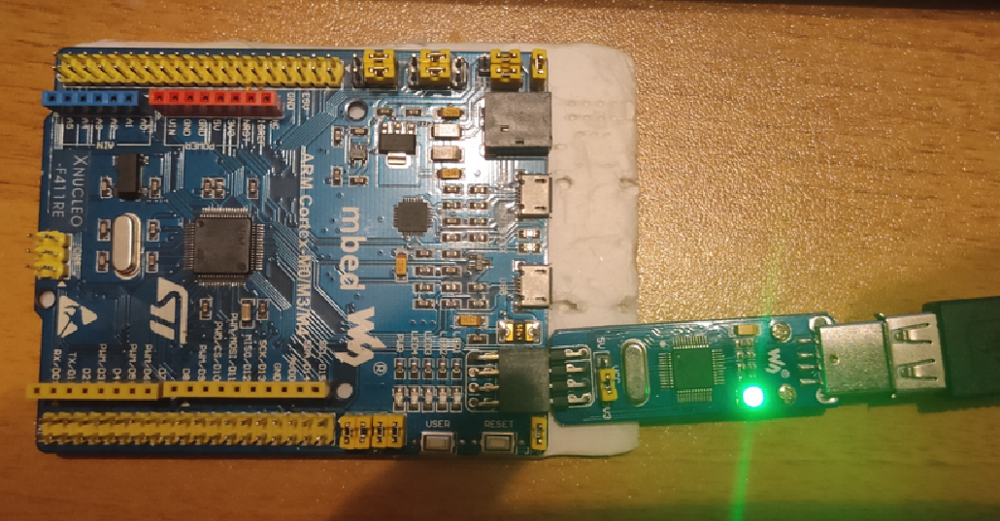

= Лабораторная №2

== Задание
* Написать программу вычисляющую следующее выражение -3/3U *3 ,удивиться увиденному и объяснить результат.
* Подключить плату к своему домашнему компу, проверить что все работает, плата прошивается и все работает как в аптеке.
* Запустить на плате Lab1 из https://githubcom/lamer0k/stm32Labs/tree/master/Lab1
Пронаблюдать, что произошло на плате, все сфоткать.
* Сделать отчет с описание удивительных вещей из пункта а) и пошаговой работы с платой, с картинками, оглавлением, кодом и всяким модным и современным форматированием, чтобы отчет был читабельным и восхитительным. Описать ошибки которые вы получали при настройки, объяснить, что за ошибки, почему они возникли и как вы их исправили.

== Программа
Напишем программу

Выведем результат в терминал

image::0.png[]

Данный микроконтроллер 32-х битный.

Старший бит отвечает за знак: 0 -- если +, 1 -- если -.

Рассмотрим представленные числа в двоичной форме:

* -3 = 1111 1111 1111 1111 1111 1111 1111 1101 (дополнительный код)

* 3 = 0000 0000 0000 0000 0000 0000 0000 0011

* 3U = 0000 0000 0000 0000 0000 0000 0000 0011

Т.к. в делении присутвует 3U программа считает что -3 (= 1111 1111 1111 1111 1111 1111 1111 1101) -- беззнаковое, то есть равно 4 294 967 293.

* Делим это число на 3 и получаем 0101 0101 0101 0101 0101 0101 0101 0100 (то есть 1 431 655 764).

* Умножаем снова на 3 и получаем 1111 1111 1111 1111 1111 1111 1111 1100 (то есть 4 294 967 292).

Т.к. результат у нас уже знаковый, то на выходе получаем -4.

== Прошивка платы

Запустили необходимый файл, выбали необходимую плату.

image::3.png[]

Выбрали необходиммый отладчик.

image::4.png[]

Прописываем необходимый код для подсведки светодиода.

 RCC::AHB1ENR::GPIOAEN::Enable::Set() ;
 GPIOA::MODER::MODER5::Output::Set() ;
 GPIOA::ODR::ODR5::High::Set() ;

Запускаем и у нас показывает ошибку:

[Og007]: Assembler list file generation not allowed in this version of the compiler

Для устранения ошибки убираем галочку с генерации листинга ассемблера и запускаем отладчик.

Старый код стирается с памяти на плате и диод гасится.

Далее снова запускаем программу и диод снова начинает светиться.

Вывод: плата работает и прошивается без особых проблем.
